# Job Tracker API

A backend API for tracking job applications, companies, interviews, and application notes.
This project is built with **FastAPI**, **PostgreSQL**, **SQLAlchemy**, **Pydantic**, and **JWT authentication**.

The main goal of this project is to provide a secure personal job application tracking system where each user can manage only their own companies, applications, interviews, and notes.

---

## Features

* User registration and login
* Password hashing using Passlib and bcrypt
* JWT-based authentication
* Protected routes using the logged-in user
* User-owned company records
* User-owned job applications
* Interview tracking for applications
* Application note tracking
* Search and filtering for job applications
* Pagination support
* Application summary/dashboard endpoint
* Duplicate email handling
* Clean router-based FastAPI project structure
* Environment variable configuration using `.env`

---

## Tech Stack

* Python
* FastAPI
* PostgreSQL
* SQLAlchemy
* Pydantic
* JWT
* Passlib
* bcrypt
* python-dotenv
* Uvicorn

---

## Project Structure

```text
job-tracker-api/
│
├── main.py
├── database.py
├── models.py
├── schemas.py
├── auth.py
├── dependencies.py
├── config.py
├── requirements.txt
├── .gitignore
│
└── routers/
    ├── __init__.py
    ├── auth_routes.py
    ├── users.py
    ├── companies.py
    ├── applications.py
    ├── interviews.py
    └── notes.py
```

---

## Database Tables

The project uses the following main tables:

```text
users
companies
job_applications
interviews
application_notes
```

### Relationship Overview

```text
User → Companies
User → Job Applications
Company → Job Applications
Job Application → Interviews
Job Application → Application Notes
```

Each company, job application, interview, and note is protected by the authenticated user.

---

## Authentication Flow

1. Register a new user.
2. Login using email and password.
3. Receive a JWT access token.
4. Use the token in Swagger or API requests.
5. Access protected routes such as companies, applications, interviews, and notes.

---

## Environment Variables

Create a `.env` file in the project root:

```env
DATABASE_URL=postgresql://your_username@localhost:5432/job_tracker_db
SECRET_KEY=change-this-secret-key
ALGORITHM=HS256
ACCESS_TOKEN_EXPIRE_MINUTES=30
```

The `.env` file should not be committed to GitHub.

---

## Installation

Clone the repository:

```bash
git clone <your-repository-url>
cd job-tracker-api
```

Create and activate a virtual environment:

```bash
python -m venv .venv
source .venv/bin/activate
```

Install dependencies:

```bash
pip install -r requirements.txt
```

---

## Run the Project

Start the FastAPI server:

```bash
python -m uvicorn main:app --reload
```

Open Swagger documentation:

```text
http://127.0.0.1:8000/docs
```

---

## API Endpoints

### Auth

```text
POST /register/
POST /login
GET  /me
```

### Users

```text
GET    /users/
GET    /users/{user_id}
PUT    /users/{user_id}
DELETE /users/{user_id}
```

### Companies

```text
POST   /companies/
GET    /companies/
GET    /companies/{company_id}
PUT    /companies/{company_id}
DELETE /companies/{company_id}
```

### Applications

```text
POST   /applications/
GET    /applications/
GET    /applications/summary
GET    /applications/{application_id}
PUT    /applications/{application_id}
DELETE /applications/{application_id}
```

### Interviews

```text
POST   /interviews/
GET    /interviews/
GET    /interviews/{interview_id}
PUT    /interviews/{interview_id}
DELETE /interviews/{interview_id}
```

### Application Notes

```text
POST   /application-notes/
GET    /application-notes/
GET    /application-notes/{note_id}
PUT    /application-notes/{note_id}
DELETE /application-notes/{note_id}
```

---

## Example Request Bodies

### Register User

```json
{
  "name": "Zarif",
  "email": "zarif@example.com",
  "password": "zarif123"
}
```

### Login

Use Swagger `/login` form:

```text
username: zarif@example.com
password: zarif123
```

After login, copy the returned access token and authorize in Swagger.

---

### Create Company

```json
{
  "name": "Google",
  "website": "https://careers.google.com",
  "location": "London",
  "industry": "Technology"
}
```

---

### Create Job Application

```json
{
  "company_id": 1,
  "job_title": "Backend Developer",
  "job_type": "full-time",
  "location": "London",
  "remote": true,
  "salary_min": 28000,
  "salary_max": 40000,
  "currency": "GBP",
  "status": "applied",
  "source": "LinkedIn",
  "job_url": "https://linkedin.com/jobs/example-backend",
  "applied_date": "2026-06-15T10:00:00",
  "deadline": "2026-07-15T23:59:00",
  "priority": "high"
}
```

---

### Create Interview

```json
{
  "application_id": 1,
  "interview_type": "technical interview",
  "scheduled_at": "2026-06-25T14:00:00",
  "location_or_link": "https://meet.google.com/example",
  "interviewer_name": "Sarah Ahmed",
  "status": "scheduled",
  "notes": "Prepare FastAPI, SQLAlchemy, PostgreSQL, and authentication."
}
```

---


### Create Application Note

```json
{
  "application_id": 1,
  "note": "Recruiter replied and moved me to technical interview stage."
}
```

---

## Application Filtering

The `/applications/` endpoint supports filtering and search.

Examples:

```text
/applications/?status=applied
/applications/?priority=high
/applications/?remote=true
/applications/?location=London
/applications/?search=backend
/applications/?skip=0&limit=10
```

---

## Summary Endpoint

The project includes an application summary endpoint:

```text
GET /applications/summary
```

It returns:

```text
total applications
applied count
interview count
rejected count
remote count
high priority count
```

This can be used later for dashboard analytics.

---

## Screenshots

### Swagger API Documentation

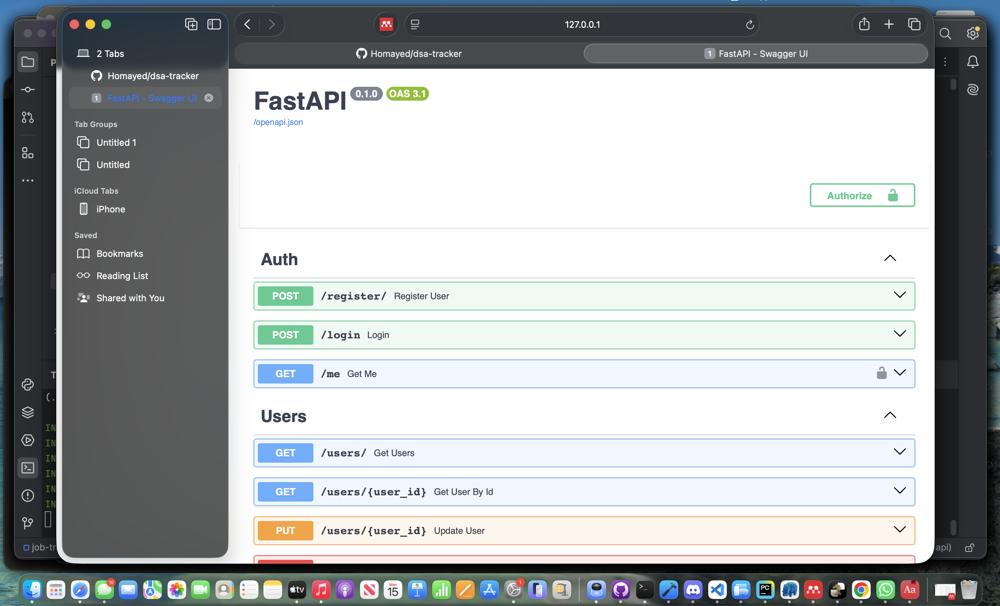
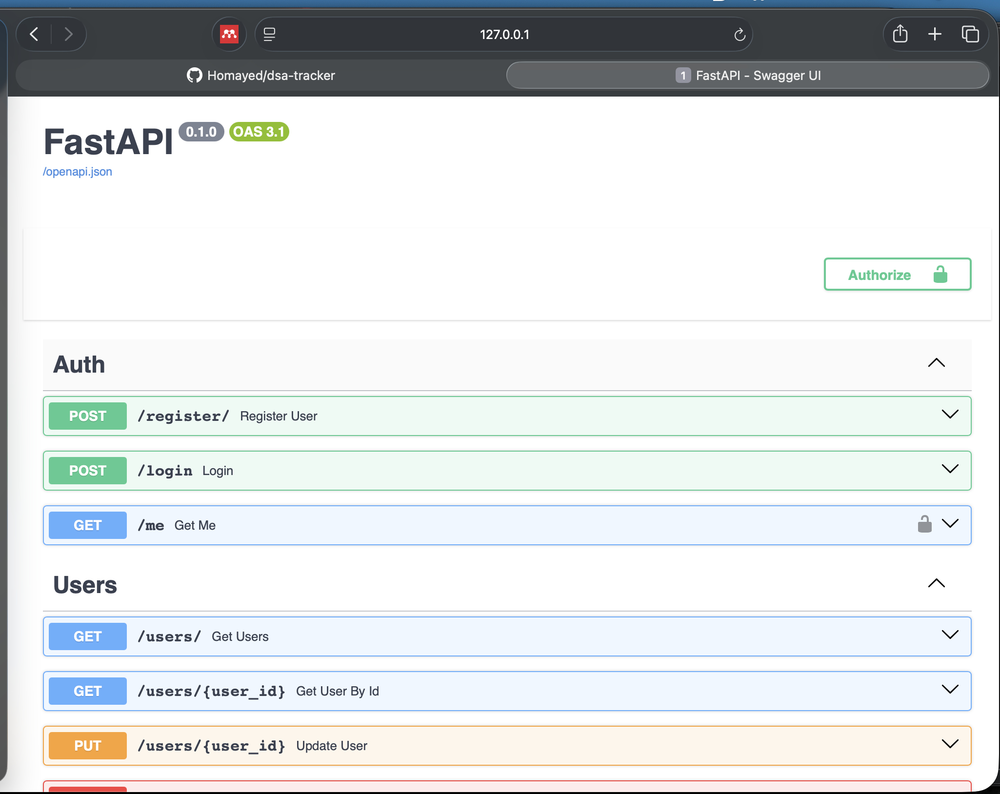
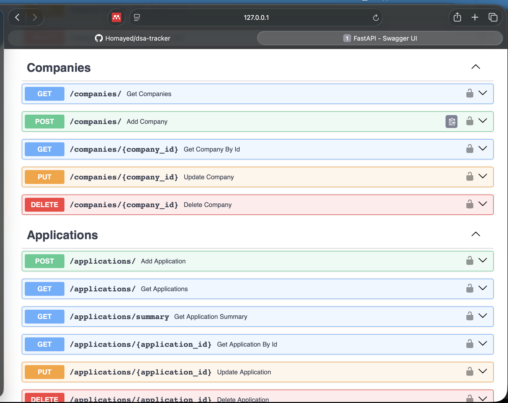
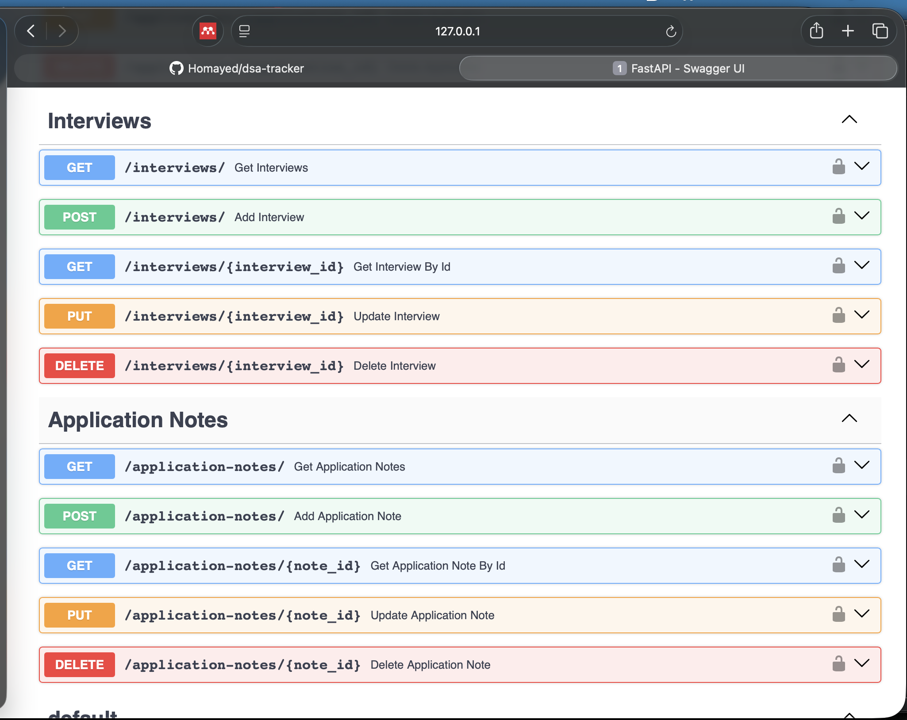
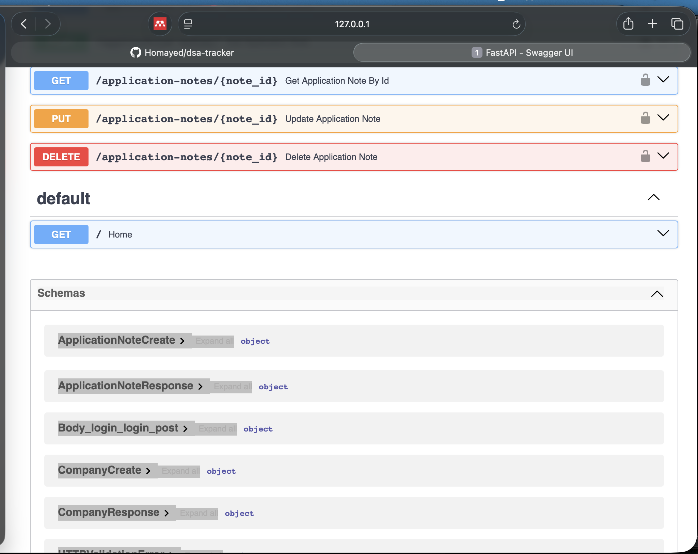

### JWT Login Authentication

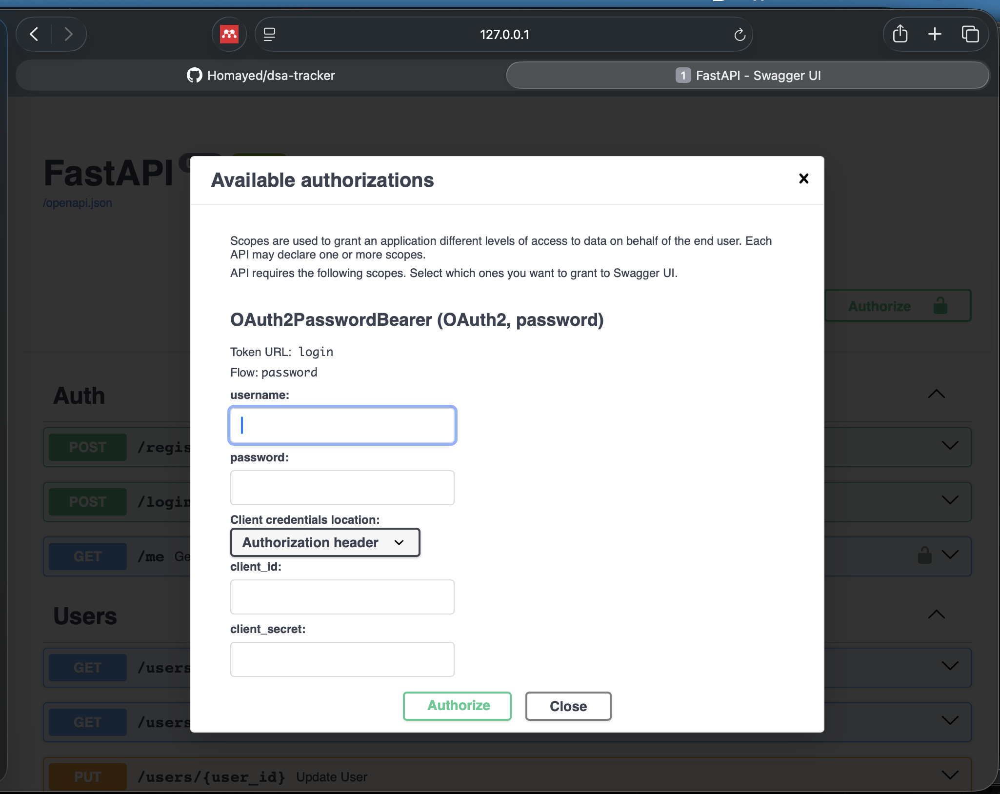
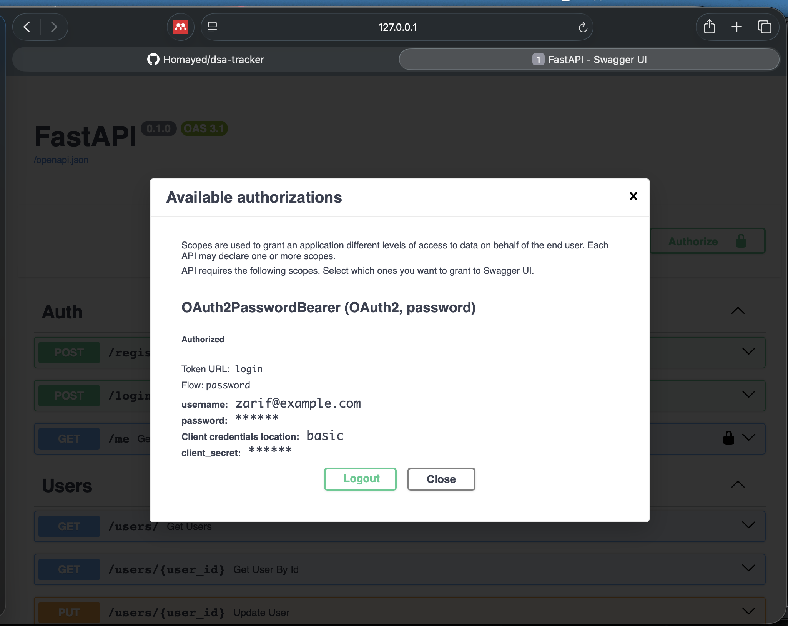

### Create Company

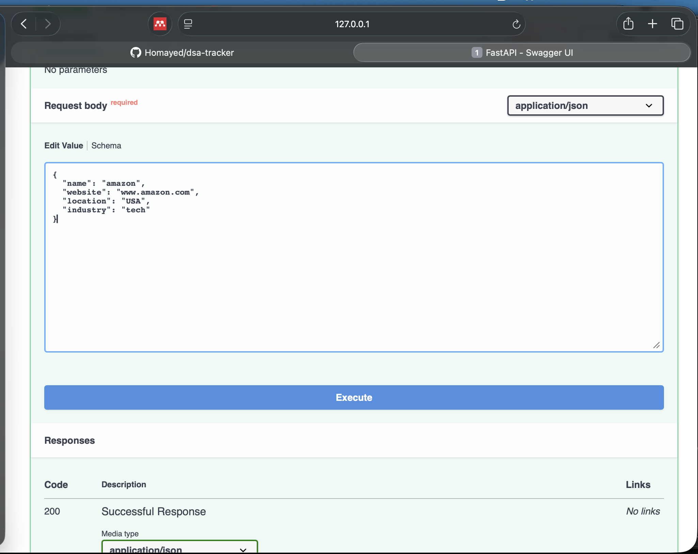
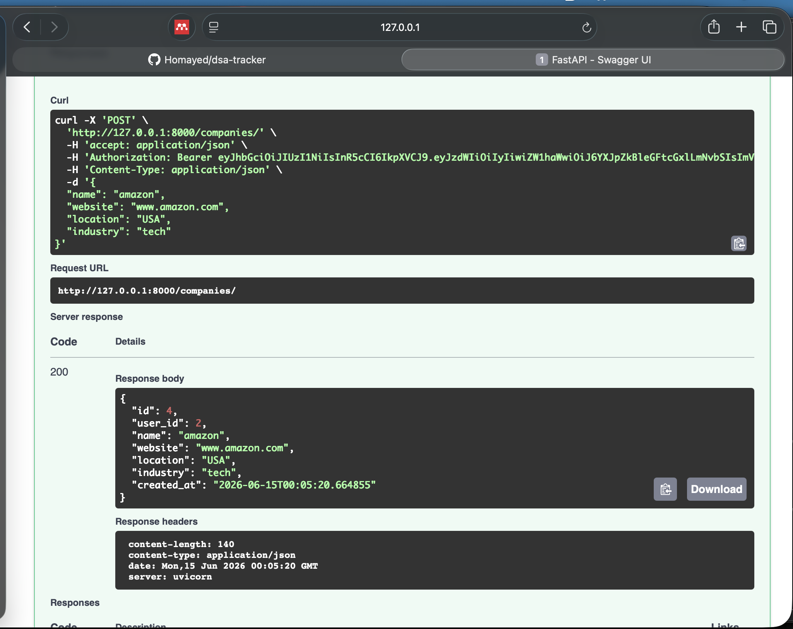

### Create Job Application

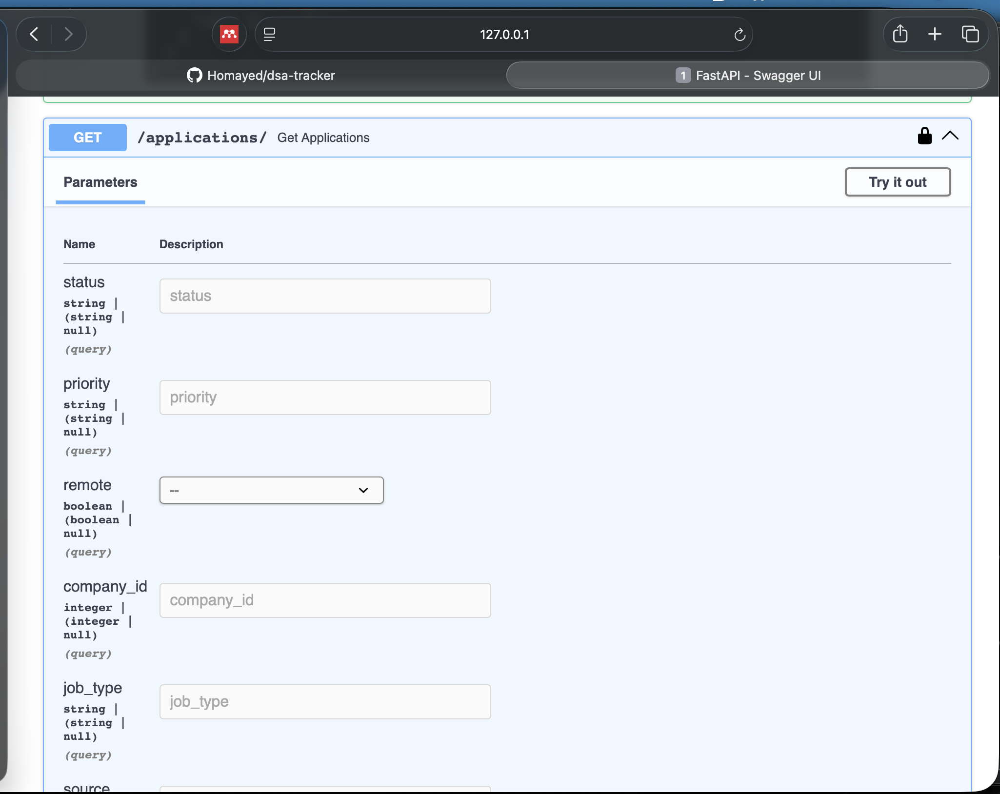

### Application Summary Dashboard Endpoint

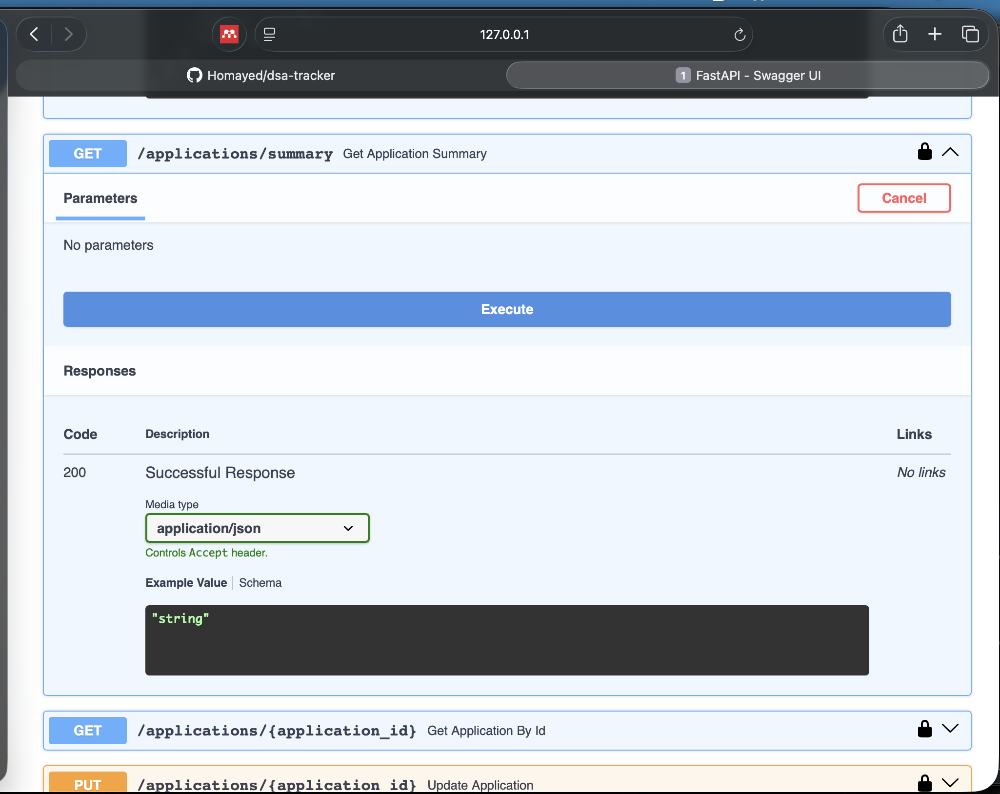
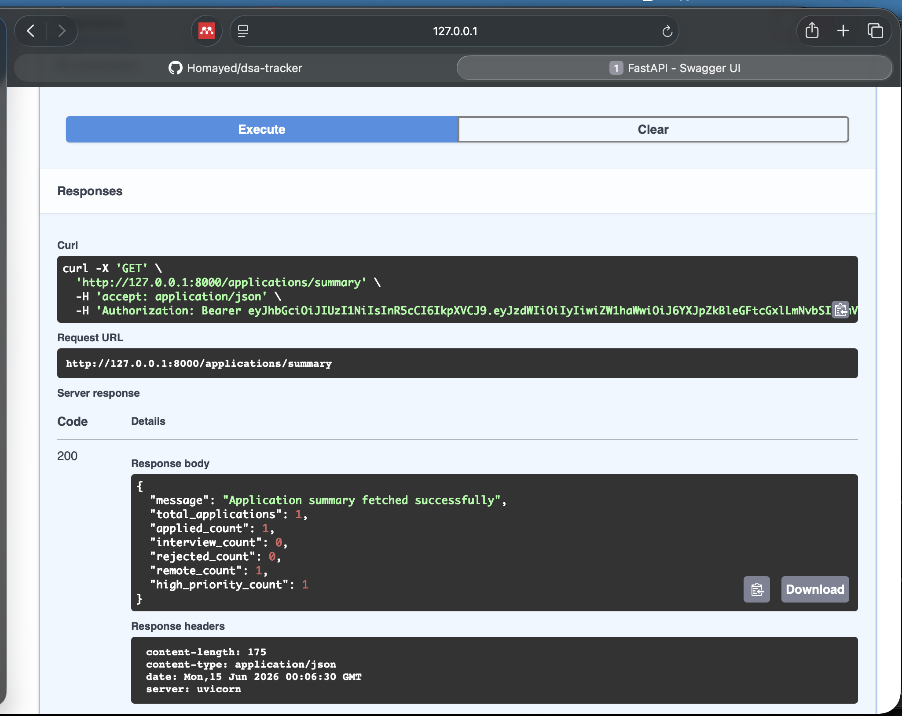


## Security Features

* Passwords are hashed before saving to the database.
* JWT tokens are used for authentication.
* Protected routes require login.
* Users can only access their own companies, applications, interviews, and notes.
* Duplicate email registration is handled safely.

---

## What I Learned

Through this project, I practiced:

* Building REST APIs with FastAPI
* Connecting FastAPI with PostgreSQL
* Creating SQLAlchemy models
* Using Pydantic schemas for request and response validation
* Implementing JWT authentication
* Protecting user-owned resources
* Structuring a FastAPI project using routers
* Handling common backend errors professionally
* Writing cleaner and more maintainable backend code

---

## Future Improvements

* Add Alembic database migrations
* Add automated tests with Pytest
* Add Docker support
* Add deployment
* Add role-based access control
* Add frontend dashboard
* Add email reminders for interviews and deadlines

---

## Status

This project is actively maintained as part of my backend software engineering portfolio.
