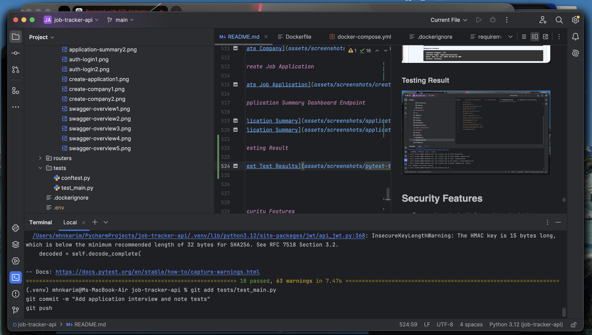

# Job Tracker API

A backend API for tracking job applications, companies, interviews, and application notes.

This project is built with **FastAPI**, **PostgreSQL**, **SQLAlchemy**, **Pydantic**, **JWT authentication**, and **Alembic database migrations**.

The main goal of this project is to provide a secure personal job application tracking system where each user can manage only their own companies, job applications, interviews, and notes.

---

## Live Demo

Live API:

```text
https://job-tracker-api-dacl.onrender.com
```

Swagger Documentation:

```text
https://job-tracker-api-dacl.onrender.com/docs
```

---

## Features

* User registration and login
* Password hashing using Passlib and bcrypt
* JWT-based authentication
* Protected routes using the logged-in user
* User-owned company records
* User-owned job applications
* Interview tracking for applications
* Application note tracking
* Search and filtering for job applications
* Pagination support
* Application summary/dashboard endpoint
* Duplicate email handling
* Clean router-based FastAPI project structure
* Environment variable configuration using `.env`
* PostgreSQL database integration
* SQLAlchemy ORM models
* Alembic database migrations
* Docker and Docker Compose support
* Automated API tests using Pytest
* Separate Docker-based PostgreSQL test database
* Tests for authentication, companies, applications, interviews, and application notes

---

## Tech Stack

* Python
* FastAPI
* PostgreSQL
* SQLAlchemy
* Alembic
* Pydantic
* JWT Authentication
* Passlib
* bcrypt
* python-dotenv
* Uvicorn
* Docker
* Docker Compose
* Pytest

---

## Project Structure

```text
job-tracker-api/
│
├── main.py
├── database.py
├── models.py
├── schemas.py
├── auth.py
├── dependencies.py
├── config.py
├── requirements.txt
├── alembic.ini
├── Dockerfile
├── docker-compose.yml
├── pytest.ini
├── .dockerignore
├── .gitignore
│
├── alembic/
│   ├── env.py
│   ├── script.py.mako
│   └── versions/
│       └── initial_schema.py
│
├── routers/
│   ├── __init__.py
│   ├── auth_routes.py
│   ├── users.py
│   ├── companies.py
│   ├── applications.py
│   ├── interviews.py
│   └── notes.py
│
├── tests/
│   ├── conftest.py
│   └── test_main.py
│
└── assets/
    └── screenshots/
```

---

## Database Tables

The project uses the following main tables:

```text
users
companies
job_applications
interviews
application_notes
```

Alembic also creates an internal migration tracking table:

```text
alembic_version
```

### Relationship Overview

```text
User → Companies
User → Job Applications
Company → Job Applications
Job Application → Interviews
Job Application → Application Notes
```

Each company, job application, interview, and note is protected by the authenticated user.

---

## Authentication Flow

1. Register a new user.
2. Login using email and password.
3. Receive a JWT access token.
4. Use the token in Swagger or API requests.
5. Access protected routes such as companies, applications, interviews, and notes.

---

## Environment Variables

Create a `.env` file in the project root:

```env
DATABASE_URL=postgresql://your_username@localhost:5432/job_tracker_db
SECRET_KEY=change-this-secret-key
ALGORITHM=HS256
ACCESS_TOKEN_EXPIRE_MINUTES=30
```

The `.env` file should not be committed to GitHub.

For Docker, the database URL usually points to the Docker PostgreSQL service name:

```env
DATABASE_URL=postgresql://postgres:postgres@db:5432/job_tracker_db
SECRET_KEY=change-this-secret-key
ALGORITHM=HS256
ACCESS_TOKEN_EXPIRE_MINUTES=30
```

---

## Installation

Clone the repository:

```bash
git clone https://github.com/Homayed/job-tracker-api.git
cd job-tracker-api
```

Create and activate a virtual environment:

```bash
python -m venv .venv
source .venv/bin/activate
```

Install dependencies:

```bash
pip install -r requirements.txt
```

Create a local PostgreSQL database:

```bash
createdb job_tracker_db
```

If `createdb` is not available, open PostgreSQL and run:

```sql
CREATE DATABASE job_tracker_db;
```

Create a `.env` file in the project root and add the required environment variables.

---

## Database Migrations

This project uses **Alembic** for database migrations.

Apply existing migrations:

```bash
alembic upgrade head
```

Create a new migration after changing SQLAlchemy models:

```bash
alembic revision --autogenerate -m "migration message"
```

Apply the new migration:

```bash
alembic upgrade head
```

Check the current migration version:

```bash
alembic current
```

Tables are created through Alembic migrations. The application does not use `Base.metadata.create_all()` in production startup.

---

## Run the Project Locally

Start the FastAPI server:

```bash
python -m uvicorn main:app --reload
```

Open Swagger documentation:

```text
http://127.0.0.1:8000/docs
```

---

## Run with Docker

This project supports Docker and Docker Compose, allowing the FastAPI app and PostgreSQL database to run together in containers.

### Build and Start Containers

```bash
docker compose up --build
```

The API will be available at:

```text
http://127.0.0.1:8000
```

Swagger API documentation:

```text
http://127.0.0.1:8000/docs
```

### Docker Services

The Docker setup includes two services:

```text
api - FastAPI backend application
db  - PostgreSQL database
```

Inside Docker, the API connects to PostgreSQL using the database service name:

```text
db:5432
```

### Run Migrations Inside Docker

After starting Docker containers, run:

```bash
docker compose exec api alembic upgrade head
```

### Stop Containers

```bash
docker compose down
```

### Stop Containers and Remove Database Volume

```bash
docker compose down -v
```

Use this only when you want to delete the Docker PostgreSQL data and start fresh.

---

## Deployment Notes

This project can be deployed on platforms such as Render.

For Render, add the required environment variables:

```text
DATABASE_URL
SECRET_KEY
ALGORITHM
ACCESS_TOKEN_EXPIRE_MINUTES
```

The start command should run database migrations before starting the server:

```bash
alembic upgrade head && uvicorn main:app --host 0.0.0.0 --port $PORT
```

This ensures the PostgreSQL database has the latest schema before the FastAPI app starts.

---

## Testing

This project includes automated API tests using **Pytest** and FastAPI's test client.

The test setup uses a separate PostgreSQL test database so tests do not affect the main development database.

### Test Coverage

The current test suite covers:

```text
Home route
User registration
Duplicate email handling
User login and JWT token generation
Protected /me route
Create company
Get companies
Company routes requiring authentication
Create job application
Get job applications
Application summary endpoint
Application routes requiring authentication
Create interview
Get interviews
Interview routes requiring authentication
Create application note
Get application notes
Application note routes requiring authentication
```

### Run Tests

The test setup uses a separate PostgreSQL test database.

Start the Docker PostgreSQL database:

```bash
docker compose up -d db
```

Create the test database inside the Docker PostgreSQL container:

```bash
docker exec -it job_tracker_db psql -U postgres -c "CREATE DATABASE job_tracker_test_db;"
```

If the database already exists, this command may show an error. In that case, you can ignore it and continue.

Run the test suite:

```bash
pytest
```

Expected result:

```text
All tests should pass successfully.
```

### Stop Docker Database

After testing:

```bash
docker compose down
```

---

## API Endpoints

### Auth

```text
POST /register/
POST /login
GET  /me
```

### Users

```text
GET    /users/
GET    /users/{user_id}
PUT    /users/{user_id}
DELETE /users/{user_id}
```

### Companies

```text
POST   /companies/
GET    /companies/
GET    /companies/{company_id}
PUT    /companies/{company_id}
DELETE /companies/{company_id}
```

### Applications

```text
POST   /applications/
GET    /applications/
GET    /applications/summary
GET    /applications/{application_id}
PUT    /applications/{application_id}
DELETE /applications/{application_id}
```

### Interviews

```text
POST   /interviews/
GET    /interviews/
GET    /interviews/{interview_id}
PUT    /interviews/{interview_id}
DELETE /interviews/{interview_id}
```

### Application Notes

```text
POST   /application-notes/
GET    /application-notes/
GET    /application-notes/{note_id}
PUT    /application-notes/{note_id}
DELETE /application-notes/{note_id}
```

---

## Example Request Bodies

### Register User

```json
{
  "name": "Zarif",
  "email": "zarif@example.com",
  "password": "zarif123"
}
```

### Login

Use Swagger `/login` form:

```text
username: zarif@example.com
password: zarif123
```

After login, copy the returned access token and authorize in Swagger.

---

### Create Company

```json
{
  "name": "Google",
  "website": "https://careers.google.com",
  "location": "London",
  "industry": "Technology"
}
```

---

### Create Job Application

```json
{
  "company_id": 1,
  "job_title": "Backend Developer",
  "job_type": "full-time",
  "location": "London",
  "remote": true,
  "salary_min": 28000,
  "salary_max": 40000,
  "currency": "GBP",
  "status": "applied",
  "source": "LinkedIn",
  "job_url": "https://linkedin.com/jobs/example-backend",
  "applied_date": "2026-06-15T10:00:00",
  "deadline": "2026-07-15T23:59:00",
  "priority": "high"
}
```

---

### Create Interview

```json
{
  "application_id": 1,
  "interview_type": "technical interview",
  "scheduled_at": "2026-06-25T14:00:00",
  "location_or_link": "https://meet.google.com/example",
  "interviewer_name": "Sarah Ahmed",
  "status": "scheduled",
  "notes": "Prepare FastAPI, SQLAlchemy, PostgreSQL, and authentication."
}
```

---

### Create Application Note

```json
{
  "application_id": 1,
  "note": "Recruiter replied and moved me to technical interview stage."
}
```

---

## Application Filtering

The `/applications/` endpoint supports filtering and search.

Examples:

```text
/applications/?status=applied
/applications/?priority=high
/applications/?remote=true
/applications/?location=London
/applications/?search=backend
/applications/?skip=0&limit=10
```

---

## Summary Endpoint

The project includes an application summary endpoint:

```text
GET /applications/summary
```

It returns:

```text
total applications
applied count
interview count
rejected count
remote count
high priority count
```

This can be used later for dashboard analytics.

---

## Screenshots

### Swagger API Documentation


### JWT Login Authentication


### Create Company


### Create Job Application


### Application Summary Dashboard Endpoint


### Testing Result



---

## Security Features

* Passwords are hashed before saving to the database.
* JWT tokens are used for authentication.
* Protected routes require login.
* Users can only access their own companies, applications, interviews, and notes.
* Duplicate email registration is handled safely.
* Environment variables are used for sensitive configuration.
* Database schema changes are managed through Alembic migrations.

---

## What I Learned

Through this project, I practiced:

* Building REST APIs with FastAPI
* Connecting FastAPI with PostgreSQL
* Creating SQLAlchemy models
* Managing database schema changes with Alembic
* Using Pydantic schemas for request and response validation
* Implementing JWT authentication
* Protecting user-owned resources
* Structuring a FastAPI project using routers
* Handling common backend errors professionally
* Writing automated API tests with Pytest
* Using Docker and Docker Compose for local development
* Writing cleaner and more maintainable backend code

---

## Future Improvements

* Expand automated test coverage, including update, delete, 404, invalid token, and multi-user ownership tests
* Add role-based access control for admin-level features
* Add CI/CD with GitHub Actions
* Add frontend dashboard for visual job tracking
* Add email reminders for interviews, deadlines, and follow-ups
* Add advanced analytics for job application progress

### Planned AI Backend Features

* Add LLM-powered job description analysis
* Add AI-generated job match scoring based on user skills and job requirements
* Add AI-assisted interview preparation suggestions
* Add AI-generated application notes and follow-up message drafts
* Add resume-to-job-description comparison using LLMs
* Add RAG-based document search for resumes, cover letters, job descriptions, and interview notes
* Add vector database support for semantic search and retrieval
* Add AI agent workflow for tracking application deadlines, suggesting next actions, and preparing follow-ups
* Add background task processing for AI analysis and notification workflows
* Add prompt management, structured LLM outputs, and validation for production-ready AI features
* Add monitoring, logging, and cost control for AI API usage

---

## Status

This project is actively maintained as part of my backend software engineering portfolio.
